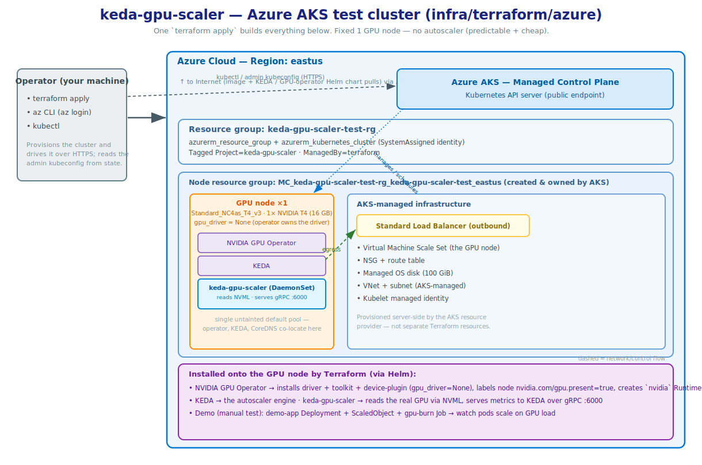

> [!WARNING]
> ## GPU service quota and cost — read this first, your apply could fail, and you may spend a lot of money
> 
> The GPUs required for  testing are very expensive, they cost around ~$1 per hour,
> this adds up to $24 per day, that's $720 per month.
> 
> Bring the infra up, run the tests, destroy everything.
>
> Fresh AWS accounts almost always have a GPU instance quota of **0**, and the
> apply will fail at node group creation with an insufficient-capacity / quota
> error.
>
> The relevant Service Quota is **"Running On-Demand G and VT instances"**
> (quota code `L-DB2E81BA`), measured in **vCPUs**, **per region**. The default
> GPU instance `g5.xlarge` is 4 vCPUs, so you need a quota of **at least 4** in
> your chosen region.
>
> Request an increase before applying:
> Service Quotas console → **Amazon EC2** → *Running On-Demand G and VT
> instances* → request ≥ 4 (or more if you bump `gpu_node_count` /
> `gpu_instance_type`). Approval can take anywhere from minutes to a couple of
> days. Verify with:
>
> ```bash
> aws service-quotas get-service-quota \
>   --service-code ec2 --quota-code L-DB2E81BA --region us-west-2
> ```

# Infrastructure-as-Code for keda-gpu-scaler

Terraform for standing up **throwaway** GPU-ready Kubernetes clusters to
integration-test `keda-gpu-scaler` against real NVIDIA hardware. These are test
clusters, not production infrastructure.

AWS (EKS) and Azure (AKS) are implemented today; GCP is planned as a sibling
directory.

## Layout

```
infra/terraform/
  aws/        # Amazon EKS (implemented)
  azure/      # Azure AKS  (implemented)
  # gcp/      # Google GKE  (planned)
```

Each cloud lives in its own self-contained, independently `apply`-able directory
(its own providers, modules, variables, state). They deliberately do **not**
share a root module, so adding GCP/Azure later is a matter of dropping in a
sibling that follows the same convention — no rework of the AWS stack.

The shared contract every directory aims to honour:

- one `terraform apply` produces a cluster immediately ready for integration
  tests (GPU drivers + device plugin, KEDA, and `keda-gpu-scaler` installed from
  the in-tree chart at `deploy/helm/keda-gpu-scaler`);
- the same `*_grpc_endpoint` / `configure_kubectl` style outputs;
- resources tagged/labelled so a forgotten cluster is easy to find and destroy.

## Status

| Target | Directory | Status |
|---|---|---|
| AWS EKS | [`aws/`](./aws) | ✅ Implemented |
| Azure AKS | [`azure/`](./azure) | ✅ Implemented (single GPU node, GPU operator) |
| GCP GKE | `gcp/` | ⏳ Planned |

## Conventions

- **Terraform version** is pinned per directory via `.terraform-version`
  (currently `1.15.6`); `required_version` floors at the current minor.
- **Providers and community modules are version-pinned**, confirmed against the
  Terraform Registry at authoring time.
- **CI is manual only** — a human runs `terraform apply` locally. Intentionally
  **not** wired into GitHub Actions (a real GPU cluster needs GPU quota and
  costs money per run).

---

# AWS EKS GPU test cluster

One `terraform apply` provisions everything and leaves nothing manual:

- a small VPC (3 AZs, single NAT gateway),
- an EKS control plane,
- **one** on-demand GPU node (EKS-optimized AL2023 NVIDIA AMI — driver + CUDA +
  container toolkit pre-installed),
- the **NVIDIA GPU operator** (device plugin, GPU-feature-discovery node labels,
  DCGM, and the `nvidia` RuntimeClass),
- **KEDA**, and
- **keda-gpu-scaler**, installed from the in-tree chart at
  `deploy/helm/keda-gpu-scaler` so the cluster always runs the local version.

It uses well-maintained community modules (`terraform-aws-modules/vpc`,
`terraform-aws-modules/eks`) rather than hand-rolled networking/EKS resources.

## Architecture


## Prerequisites

- **Terraform 1.15.6** — pinned in [`aws/.terraform-version`](./aws/.terraform-version)
  (use `tfenv` to match it exactly).
- **awscli v2** on `PATH` with valid credentials for the target account/region.
  The Kubernetes/Helm providers call `aws eks get-token` to authenticate.
- **kubectl** and **helm** (for poking at the cluster after apply; not required
  by Terraform itself).
- The **GPU service quota** above.
- Registry access from the machine running Terraform: `terraform init` fetches
  the VPC/EKS modules and the aws/kubernetes/helm providers from the public
  Terraform Registry, and the apply pulls the GPU operator and KEDA charts from
  `helm.ngc.nvidia.com` and `kedacore.github.io`.

## Usage

```bash
cd infra/terraform/aws

cp terraform.tfvars.example terraform.tfvars   # optional: override defaults

terraform init
terraform apply

# Point kubectl at the new cluster (also emitted as the `configure_kubectl` output)
aws eks update-kubeconfig --region us-west-2 --name keda-gpu-scaler-test

# Confirm the GPU is visible and the scaler is running on it
kubectl get nodes -L nvidia.com/gpu.present
kubectl -n keda get pods -o wide
kubectl -n keda get scaledobject
```

The scaler is reachable in-cluster at the `scaler_grpc_endpoint` output, e.g.
`keda-gpu-scaler.keda.svc.cluster.local:6000` — that's the `scalerAddress` a
KEDA `ScaledObject` external trigger should target.

## Common overrides

| Variable | Default | Notes |
|---|---|---|
| `region` | `us-west-2` | Choose one with GPU capacity + your quota. |
| `gpu_instance_type` | `g5.xlarge` (A10G) | Cheaper: `g4dn.xlarge` (T4). Newer: `g6.xlarge` (L4). |
| `gpu_node_count` | `1` | Fixed-size pool (min = max = desired). |
| `kubernetes_version` | `1.35` | EKS control plane version (latest is 1.36; keep to a version in standard support). |
| `gpu_operator_chart_version` | `v26.3.2` | NVIDIA GPU operator chart. |
| `keda_chart_version` | `2.20.1` | KEDA chart. |

```bash
terraform apply -var 'gpu_instance_type=g4dn.xlarge'
```

## Cost

You are paying for real GPU hardware — **destroy it when you're done.** Rough
on-demand list prices (us-west-2, USD; check current pricing for your region):

| Component | Approx. cost |
|---|---|
| EKS control plane | ~$0.10/hr (~$73/mo) |
| 1x `g5.xlarge` GPU node | ~$1.0/hr (~$24/day) |
| NAT gateway | ~$0.045/hr + data processing |
| EBS (100 GiB gp3) + misc | a few $/day |

Ballpark: **~$1.2/hr (~$28/day)** with the defaults. `g4dn.xlarge` is roughly
half the GPU cost.

## Teardown

```bash
terraform destroy
```

This removes everything this stack created. If a `terraform destroy` is ever
interrupted, the resource tags make leftovers easy to find:

```bash
# Every resource is tagged Project=keda-gpu-scaler, ManagedBy=terraform
aws resourcegroupstaggingapi get-resources \
  --tag-filters Key=Project,Values=keda-gpu-scaler --region us-west-2
```

## How the cluster satisfies the scaler chart

`keda-gpu-scaler` is a privileged DaemonSet that links `libnvidia-ml.so` at
runtime, so it only starts on a host with working NVIDIA drivers. The chart
(see `deploy/helm/keda-gpu-scaler/values.yaml`) expects the node to provide:

| Chart requirement | Provided by |
|---|---|
| `nodeSelector: nvidia.com/gpu.present=true` | GPU-feature-discovery (GPU operator) labels the GPU node |
| `runtimeClassName: nvidia` | GPU operator creates the `nvidia` RuntimeClass; the AL2023 NVIDIA AMI configures the `nvidia` containerd runtime |
| working driver + `libnvidia-ml.so` | pre-installed on the AL2023 NVIDIA AMI |
| `tolerations: nvidia.com/gpu` | harmless no-op here — the single GPU pool is intentionally untainted so KEDA/CoreDNS can co-locate |

Because the node pool is a single untainted GPU pool, KEDA, the GPU operator
controllers and CoreDNS all schedule on the GPU node alongside the scaler. If
you taint GPU nodes, add a separate CPU node group for those system pods.

---

# Azure AKS GPU test cluster

Sibling to the AWS stack. One `terraform apply` provisions everything, no manual
steps:

- a resource group,
- an AKS control plane (Free tier — Microsoft-managed API server, no
  control-plane charge),
- **one** on-demand GPU node as the cluster's untainted default pool, created
  with `gpu_driver = "None"` so AKS installs no GPU software,
- the **NVIDIA GPU operator** (host driver, container toolkit, device plugin,
  GPU-feature-discovery labels, DCGM, and the `nvidia` RuntimeClass),
- **KEDA**, and
- **keda-gpu-scaler**, installed from the in-tree chart.

Unlike EKS, AKS manages its own VNet, so there is no networking module — the
native `azurerm_kubernetes_cluster` resource is the whole cluster.

## Architecture



## Pinned versions

Confirmed against current sources before authoring — the Terraform Registry /
provider docs for provider + module versions and resource schemas, and Microsoft
Learn for AKS GPU guidance (driver options, device plugin vs GPU operator):

| Component | Pin | Notes |
|---|---|---|
| Terraform | `1.15.6` (floor `>= 1.15.0`) | `.terraform-version` |
| azurerm provider | `~> 4.79` | current 4.x |
| kubernetes / helm providers | `~> 3.2` | |
| Kubernetes (AKS) | `1.33` | current in-support minor (validated); 1.34/1.35 also supported |
| GPU VM size | `Standard_NC4as_T4_v3` | 1× NVIDIA T4, 4 vCPUs |
| NVIDIA GPU operator chart | `v26.3.2` | |
| KEDA chart | `2.20.1` | |
| scaler image | `ghcr.io/pmady/keda-gpu-scaler:v0.5.0` | chart `appVersion` has no published image, so pin a real tag |

Cluster module: `Azure/aks/azurerm` (v11.7.0) was evaluated and **not** used —
see Methodology.

## Methodology

- **Native `azurerm_kubernetes_cluster`, not a cluster module.** AKS needs no
  networking module (it manages its own VNet), and the community module exposes
  `gpu_driver` only on *extra* node pools — which would force a 2-pool
  (system + GPU) design. Native lets the single GPU node be the untainted
  default pool: the cheapest layout and a mirror of the EKS single-pool design.
- **GPU operator over AKS built-in GPU support.** Only the operator supplies all
  four things the chart needs unchanged (see the table below). So the node pool
  sets `gpu_driver = "None"` and the operator owns the whole stack — NVIDIA's
  documented AKS path. This is the inverse of EKS, where the AMI ships the driver
  so the operator runs with `driver.enabled=false`.
- **KEDA before the scaler.** The scaler chart renders a `ScaledObject`, so
  KEDA's CRDs must exist first (`depends_on`).

## Resources deployed

`terraform apply` shows **5** resources (resource group + cluster + 3 Helm
releases). AKS then provisions the rest server-side in a secondary *node
resource group* (`MC_<rg>_<cluster>_<location>`), so the real footprint is larger
than the plan count:

| Terraform-managed | AKS-managed (node resource group) |
|---|---|
| `azurerm_resource_group` | Virtual Machine Scale Set (the GPU node) |
| `azurerm_kubernetes_cluster` (SystemAssigned identity) | Standard Load Balancer (outbound) |
| `helm_release.gpu_operator` | NSG + route table |
| `helm_release.keda` | Managed OS disk (100 GiB) |
| `helm_release.keda_gpu_scaler` | VNet + subnet, kubelet identity |

All Terraform-managed resources are tagged `Project=keda-gpu-scaler`,
`ManagedBy=terraform`.

## GPU vCPU quota — your apply fails without it

Fresh subscriptions have a GPU quota of **0**, per-region and per-VM-family. The
default T4 SKU draws on **"Standard NCASv3_T4 Family vCPUs"**
(`Standard_NC4as_T4_v3` = 4 vCPUs), so request **≥ 4** in your `location` before
applying (portal → **Subscriptions → Usage + quotas**). Verify:

```bash
az vm list-usage --location eastus --query "[?contains(name.value, 'NCASv3_T4')]" -o table
```

## Usage

```bash
cd infra/terraform/azure

export ARM_SUBSCRIPTION_ID=<your-subscription-id>
cp terraform.tfvars.example terraform.tfvars   # optional: all vars have defaults

terraform init
terraform apply

# Point kubectl at the new cluster (also emitted as the `configure_kubectl` output)
az aks get-credentials --resource-group keda-gpu-scaler-test-rg \
  --name keda-gpu-scaler-test --overwrite-existing

kubectl get nodes -L nvidia.com/gpu.present
kubectl -n keda get pods -o wide
kubectl -n keda get scaledobject
```

## Common overrides

| Variable | Default | Notes |
|---|---|---|
| `location` | `eastus` | A region with T4 capacity + your quota. |
| `gpu_vm_size` | `Standard_NC4as_T4_v3` (T4) | Bigger: `Standard_NC24ads_A100_v4` (A100), `Standard_NC24ads_L40S_v4` (L40S). |
| `gpu_node_count` | `1` | Fixed-size pool (no autoscaler). |
| `kubernetes_version` | `1.33` | Current in-support minor; 1.34/1.35 also supported. |
| `gpu_operator_chart_version` | `v26.3.2` | NVIDIA GPU operator chart. |
| `keda_chart_version` | `2.20.1` | KEDA chart. |

## Cost & teardown

The AKS control plane is Free-tier ($0); you pay for the GPU VM (~$0.53/hr for
the default T4) plus a managed disk — ballpark **~$0.55/hr (~$14/day)**, cheaper
than EKS (no paid control plane, no NAT gateway). **Destroy when done:**

```bash
terraform destroy   # removes the resource group and everything in it
# leftovers, if a destroy is ever interrupted:
az resource list --tag Project=keda-gpu-scaler -o table
```

## How the cluster satisfies the scaler chart

| Chart requirement | Provided by |
|---|---|
| `nodeSelector: nvidia.com/gpu.present=true` | GPU-feature-discovery (operator) labels the node |
| `runtimeClassName: nvidia` | operator's container toolkit configures containerd's `nvidia` runtime + creates the RuntimeClass |
| working driver + `libnvidia-ml.so` | operator's driver daemonset (`gpu_driver = "None"` skips AKS's) |
| privileged | the chart's own securityContext |

The GPU node is the untainted default pool, so KEDA, the operator controllers and
CoreDNS co-locate with the scaler.
