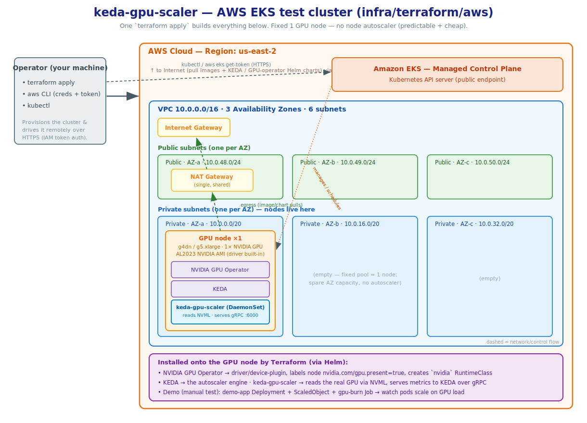

# AWS EKS GPU test cluster (Terraform)

Stands up a **throwaway** GPU-ready EKS cluster, fully wired so `keda-gpu-scaler`
can be integration-tested against real NVIDIA hardware. One `terraform apply`
provisions everything and leaves nothing manual:

- a small VPC (3 AZs, single NAT gateway),
- an EKS control plane,
- **one** on-demand GPU node (EKS-optimized AL2023 NVIDIA AMI — driver + CUDA +
  container toolkit pre-installed),
- the **NVIDIA GPU operator** (device plugin, GPU-feature-discovery node labels,
  DCGM, and the `nvidia` RuntimeClass),
- **KEDA**, and
- **keda-gpu-scaler**, installed from the in-tree chart at
  `deploy/helm/keda-gpu-scaler` so the cluster always runs the local version.

This is a test cluster, not production infrastructure. It uses well-maintained
community modules (`terraform-aws-modules/vpc`, `terraform-aws-modules/eks`)
rather than hand-rolled networking/EKS resources.

## Architecture




> [!WARNING]
> ## GPU service quota — read this first, or your apply will fail
>
> Fresh AWS accounts almost always have a GPU instance quota of **0**, and the
> apply will fail at node group creation with an insufficient-capacity / quota
> error.
>
> The relevant Service Quota is **"Running On-Demand G and VT instances"**
> (quota code `L-DB2E81BA`), measured in **vCPUs**, **per region**. The default
> GPU instance `g5.xlarge` is 4 vCPUs, so you need a quota of **at least 4** in
> your chosen region.
>
> Request an increase before applying:
> Service Quotas console → **Amazon EC2** → *Running On-Demand G and VT
> instances* → request ≥ 4 (or more if you bump `gpu_node_count` /
> `gpu_instance_type`). Approval can take anywhere from minutes to a couple of
> days. Verify with:
>
> ```bash
> aws service-quotas get-service-quota \
>   --service-code ec2 --quota-code L-DB2E81BA --region us-west-2
> ```

## Prerequisites

- **Terraform 1.15.6** — pinned in [`.terraform-version`](./.terraform-version)
  (use `tfenv` to match it exactly).
- **awscli v2** on `PATH` with valid credentials for the target account/region.
  The Kubernetes/Helm providers call `aws eks get-token` to authenticate.
- **kubectl** and **helm** (for poking at the cluster after apply; not required
  by Terraform itself).
- The **GPU service quota** above.
- Registry access from the machine running Terraform: `terraform init` fetches
  the VPC/EKS modules and the aws/kubernetes/helm providers from the public
  Terraform Registry, and the apply pulls the GPU operator and KEDA charts from
  `helm.ngc.nvidia.com` and `kedacore.github.io`.

## Usage

```bash
cd infra/terraform/aws

cp terraform.tfvars.example terraform.tfvars   # optional: override defaults

terraform init
terraform apply

# Point kubectl at the new cluster (also emitted as the `configure_kubectl` output)
aws eks update-kubeconfig --region us-west-2 --name keda-gpu-scaler-test

# Confirm the GPU is visible and the scaler is running on it
kubectl get nodes -L nvidia.com/gpu.present
kubectl -n keda get pods -o wide
kubectl -n keda get scaledobject
```

The scaler is reachable in-cluster at the `scaler_grpc_endpoint` output, e.g.
`keda-gpu-scaler.keda.svc.cluster.local:6000` — that's the `scalerAddress` a
KEDA `ScaledObject` external trigger should target.

## Common overrides

| Variable | Default | Notes |
|---|---|---|
| `region` | `us-west-2` | Choose one with GPU capacity + your quota. |
| `gpu_instance_type` | `g5.xlarge` (A10G) | Cheaper: `g4dn.xlarge` (T4). Newer: `g6.xlarge` (L4). |
| `gpu_node_count` | `1` | Fixed-size pool (min = max = desired). |
| `kubernetes_version` | `1.35` | EKS control plane version (latest is 1.36; keep to a version in standard support). |
| `gpu_operator_chart_version` | `v26.3.2` | NVIDIA GPU operator chart. |
| `keda_chart_version` | `2.20.1` | KEDA chart. |

```bash
terraform apply -var 'gpu_instance_type=g4dn.xlarge'
```

## Cost

You are paying for real GPU hardware — **destroy it when you're done.** Rough
on-demand list prices (us-west-2, USD; check current pricing for your region):

| Component | Approx. cost |
|---|---|
| EKS control plane | ~$0.10/hr (~$73/mo) |
| 1x `g5.xlarge` GPU node | ~$1.0/hr (~$24/day) |
| NAT gateway | ~$0.045/hr + data processing |
| EBS (100 GiB gp3) + misc | a few $/day |

Ballpark: **~$1.2/hr (~$28/day)** with the defaults. `g4dn.xlarge` is roughly
half the GPU cost.

## Teardown

```bash
terraform destroy
```

This removes everything this stack created. If a `terraform destroy` is ever
interrupted, the resource tags make leftovers easy to find:

```bash
# Every resource is tagged Project=keda-gpu-scaler, ManagedBy=terraform
aws resourcegroupstaggingapi get-resources \
  --tag-filters Key=Project,Values=keda-gpu-scaler --region us-west-2
```

## How the cluster satisfies the scaler chart

`keda-gpu-scaler` is a privileged DaemonSet that links `libnvidia-ml.so` at
runtime, so it only starts on a host with working NVIDIA drivers. The chart
(see `deploy/helm/keda-gpu-scaler/values.yaml`) expects the node to provide:

| Chart requirement | Provided by |
|---|---|
| `nodeSelector: nvidia.com/gpu.present=true` | GPU-feature-discovery (GPU operator) labels the GPU node |
| `runtimeClassName: nvidia` | GPU operator creates the `nvidia` RuntimeClass; the AL2023 NVIDIA AMI configures the `nvidia` containerd runtime |
| working driver + `libnvidia-ml.so` | pre-installed on the AL2023 NVIDIA AMI |
| `tolerations: nvidia.com/gpu` | harmless no-op here — the single GPU pool is intentionally untainted so KEDA/CoreDNS can co-locate |

Because the node pool is a single untainted GPU pool, KEDA, the GPU operator
controllers and CoreDNS all schedule on the GPU node alongside the scaler. If
you taint GPU nodes, add a separate CPU node group for those system pods.
